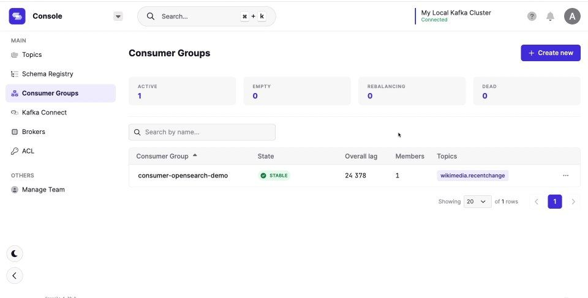
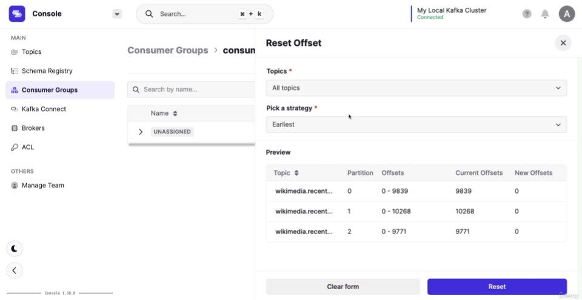

# Kafka Java Producer/Consumer Demo

A minimal Java application demonstrating Kafka client APIs.

## Highlights
- Plain Java producer and consumer using `org.apache.kafka.clients`
- Configurable via `application.properties`
- Docker image included for local Kafka environment
- Clean Maven structure with runnable main methods

## How to Use
1. Clone repo
2. Start Kafka with Docker or local install
3. `mvn clean package`
4. Run:
   ```bash
   java -cp target/demo.jar com.example.ProducerApp
   java -cp target/demo.jar com.example.ConsumerApp

## 📸 Demo

Here’s a preview of the project in action:

### 🔍 Consumer Group Monitoring
Shows the status of your Kafka consumer group and lag.



### 🔄 Resetting Offsets
Preview and reset Kafka offsets by partition using the UI.

